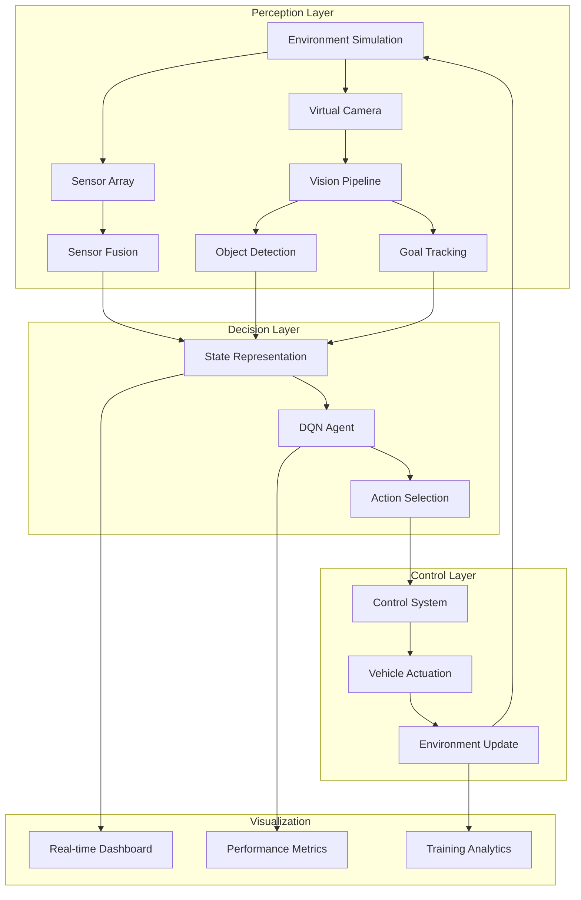

# Autonomous Navigation System with AI Obstacle Avoidance
A comprehensive software-based autonomous navigation system that simulates embedded systems, computer vision, and reinforcement learning for intelligent obstacle avoidance and path planning.

## Overview

This project simulates a complete autonomous navigation system that combines embedded system simulation, computer vision, and reinforcement learning to create an intelligent vehicle capable of navigating dynamic environments while avoiding obstacles.

## Features

###  Embedded System Simulation

- Virtual ultrasonic/LiDAR sensors with configurable parameters

- Simulated camera with adjustable FOV and resolution

- Vehicle kinematics with realistic physics

- Dynamic environment with randomly generated obstacles

- Collision detection and sensor fusion

### AI-Powered Computer Vision

- Lightweight CNN for real-time object detection

- Edge detection and contour analysis for obstacle identification

- Goal tracking using HSV color space filtering

- Frame preprocessing optimized for embedded constraints

- Noise simulation for realistic sensor data

### Reinforcement Learning Agent

- Deep Q-Network (DQN) with experience replay

- Epsilon-greedy exploration strategy

- Reward shaping for effective navigation learning

- Target network for stable Q-value estimation

- Configurable training parameters

### Navigation & Control

- Sensor fusion combining vision and distance data

- DQN-based decision making for path planning

- Smooth action-to-control mapping

- Performance monitoring and analytics dashboard

- Real-time visualization system

## Architecture



## Installation

### Clone and setup

```
# Clone the repository
git clone https://github.com/yourusername/autonomous-navigation.git
cd autonomous-navigation

# Create virtual environment (recommended)
python -m venv venv

# Activate virtual environment
# On Windows:
venv\Scripts\activate
# On macOS/Linux:
source venv/bin/activate

# Install dependencies
pip install -r requirements.txt
```

### Verify installation

```
python -c "import tensorflow as tf; print('TF:', tf.__version__)"
python -c "import cv2; print('OpenCV:', cv2.__version__)"
```

## Usage

### Interactive Demo Menu

```
==================================================
🚀 AUTONOMOUS NAVIGATION SYSTEM
==================================================
1. 🎓 Train AI Agent (50+ episodes recommended)
2. 🎬 Run Live Demonstration (Watch AI navigate)
3. 🧪 Test Single Episode (Quick validation)
4. 📊 View System Architecture & Documentation
5. 🚪 Exit
```

### Training Mode

```
# Train the DQN agent
Enter number of training episodes: 50
Starting training...
Episode 1/50: Steps=300, Reward=-12.34, Success=False, Epsilon=0.995
Episode 10/50: Steps=245, Reward=45.67, Success=True, Epsilon=0.902
Episode 50/50: Steps=156, Reward=89.12, Success=True, Epsilon=0.078
Training completed! Success rate: 76%
```

### Live Demo Mode

```
Enter number of demo episodes: 3
Starting demonstration...
Episode 1: ✅ Goal reached in 187 steps!
Episode 2: ✅ Goal reached in 154 steps!
Episode 3: ⚠️ Collision at step 203
```

## Sample Training Log

```
╔══════════════════════════════════════════════════════════════╗
║                      TRAINING PROGRESS                       ║
╠══════════╦════════╦══════════╦═══════════╦══════════════════╣
║ Episode  ║ Steps  ║ Reward   ║ Success   ║ Exploration Rate ║
╠══════════╬════════╬══════════╬═══════════╬══════════════════╣
║    1     ║  300   ║  -12.34  ║   ❌      ║      99.5%       ║
║    10    ║  245   ║   45.67  ║   ✅      ║      90.2%       ║
║    25    ║  198   ║   68.91  ║   ✅      ║      56.7%       ║
║    50    ║  156   ║   89.12  ║   ✅      ║       7.8%       ║
╚══════════╩════════╩══════════╩═══════════╩══════════════════╝
```

## Project Structure

```
autonomous-navigation/
├── 🐍 autonomous_navigation.py  # Main application
├── 📄 requirements.txt          # Dependencies
├── 📄 README.md                 # This file
├── 📄 LICENSE                   # MIT License
├── 📄 .gitignore                # Git ignore rules
└── 📄 CONTRIBUTING.md           # Contribution guidelines
```

## Core Module Breakdown

```
# 1. Environment Simulation
AutonomousEnvironment()          # Simulates embedded sensors & camera
    ├── update_sensor_readings() # Virtual LiDAR/ultrasonic
    ├── simulate_camera_frame()  # Virtual camera feed
    └── update_vehicle_position()# Physics simulation

# 2. Computer Vision
VisionPerceptionSystem()         # AI-powered perception
    ├── preprocess_frame()       # Image normalization
    ├── detect_objects()         # Obstacle detection
    └── detect_goals()           # Goal tracking

# 3. Reinforcement Learning
DQNAgent()                      # Deep Q-Network agent
    ├── act()                   # Action selection
    ├── remember()              # Experience replay
    └── replay()                # Training step

# 4. Main Controller
AutonomousNavigationController() # System integration
    ├── get_state_representation()
    ├── calculate_reward()
    └── run_episode()
```

## Customization Guide

### Modify Environment Parameters

```
# In autonomous_navigation.py, modify these constants:

ENVIRONMENT_CONFIG = {
    'width': 1000,           # Environment width
    'height': 800,           # Environment height
    'sensor_range': 200,     # Sensor detection range
    'num_obstacles': 20,     # Number of obstacles
    'camera_res': (320, 240) # Camera resolution
}
```

### Adjust AI Parameters

```
# Modify DQN training parameters:
DQN_CONFIG = {
    'gamma': 0.99,           # Discount factor
    'epsilon_decay': 0.995,  # Exploration decay
    'learning_rate': 0.001,  # Learning rate
    'batch_size': 32         # Training batch size
}
```

### Add New Features

```
# Example: Add GPS simulation
class GPSModule:
    def __init__(self):
        self.position_error = 0.5  # Simulated GPS error
        
    def get_position(self, true_position):
        # Add Gaussian noise to simulate real GPS
        noisy_pos = true_position + np.random.normal(0, self.position_error, 2)
        return noisy_pos
```

## Technical Deep Dive

### Reinforcement Learning Implementation

```
# Deep Q-Network Architecture
model = Sequential([
    Dense(64, input_dim=state_size, activation='relu'),
    Dense(64, activation='relu'),
    Dense(32, activation='relu'),
    Dense(action_size, activation='linear')  # Q-values for each action
])

# Experience Replay Buffer
memory = deque(maxlen=2000)  # Stores (state, action, reward, next_state, done)
```

### Computer Vision Pipeline

```
# Simplified object detection pipeline
def detect_objects(frame):
    # 1. Convert to grayscale
    gray = cv2.cvtColor(frame, cv2.COLOR_RGB2GRAY)
    
    # 2. Edge detection
    edges = cv2.Canny(gray, 50, 150)
    
    # 3. Find contours
    contours, _ = cv2.findContours(edges, cv2.RETR_EXTERNAL, cv2.CHAIN_APPROX_SIMPLE)
    
    # 4. Calculate obstacle presence
    obstacle_presence = min(len(contours) / 10.0, 1.0)
    
    return obstacle_presence
```

## Performance Optimization Tips

### For Faster Training:

```
# Reduce environment size
environment = AutonomousEnvironment(width=600, height=400)

# Lower camera resolution
camera_resolution = (80, 60)
```

### For Better Accuracy:

```
# Increase training episodes
controller.train(num_episodes=200)

# Use larger neural network
model = Sequential([
    Dense(128, activation='relu'),
    Dense(128, activation='relu'),
    Dense(64, activation='relu'),
    Dense(action_size, activation='linear')
])
```

## Testing & Validation

```
# Run unit tests
python -m pytest tests/

# Run specific module tests
python -m pytest tests/test_environment.py
python -m pytest tests/test_vision.py
python -m pytest tests/test_rl_agent.py
```

## Deployment Guide

### Save Trained Model

```
# Save model weights
controller.dqn_agent.save('models/navigation_model.h5')

# Save entire model
controller.dqn_agent.model.save('models/full_model')
```

### Load Pre-trained Model

```
# Load for inference
controller.dqn_agent.load('models/navigation_model.h5')
controller.demo(num_episodes=5)
```

### Export for Web Demo

```
# Convert to TensorFlow.js
import tensorflowjs as tfjs
tfjs.converters.save_keras_model(model, 'web_model')
```

## Development Setup:

```
# Fork and clone
git clone https://github.com/yourusername/autonomous-navigation.git

# Create feature branch
git checkout -b feature/your-feature-name

# Make changes and test
python autonomous_navigation.py

# Commit and push
git commit -m "Add your feature"
git push origin feature/your-feature-name

# Create pull request
```

## Acknowledgments

- TensorFlow/Keras team for the excellent deep learning framework

- OpenCV community for computer vision tools

- NumPy/Matplotlib for scientific computing and visualization

- Academic Researchers whose work inspired this implementation
  
