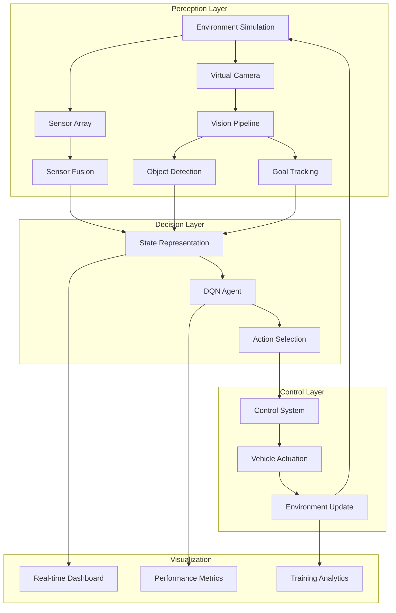

# Autonomous Navigation System with AI Obstacle Avoidance
A comprehensive software-based autonomous navigation system that simulates embedded systems, computer vision, and reinforcement learning for intelligent obstacle avoidance and path planning.

## Overview

This project simulates a complete autonomous navigation system that combines embedded system simulation, computer vision, and reinforcement learning to create an intelligent vehicle capable of navigating dynamic environments while avoiding obstacles.

## Features

###  Embedded System Simulation

- Virtual ultrasonic/LiDAR sensors with configurable parameters

- Simulated camera with adjustable FOV and resolution

- Vehicle kinematics with realistic physics

- Dynamic environment with randomly generated obstacles

- Collision detection and sensor fusion

### AI-Powered Computer Vision

- Lightweight CNN for real-time object detection

- Edge detection and contour analysis for obstacle identification

- Goal tracking using HSV color space filtering

- Frame preprocessing optimized for embedded constraints

- Noise simulation for realistic sensor data

### Reinforcement Learning Agent

- Deep Q-Network (DQN) with experience replay

- Epsilon-greedy exploration strategy

- Reward shaping for effective navigation learning

- Target network for stable Q-value estimation

- Configurable training parameters

### Navigation & Control

- Sensor fusion combining vision and distance data

- DQN-based decision making for path planning

- Smooth action-to-control mapping

- Performance monitoring and analytics dashboard

- Real-time visualization system

## Architecture

